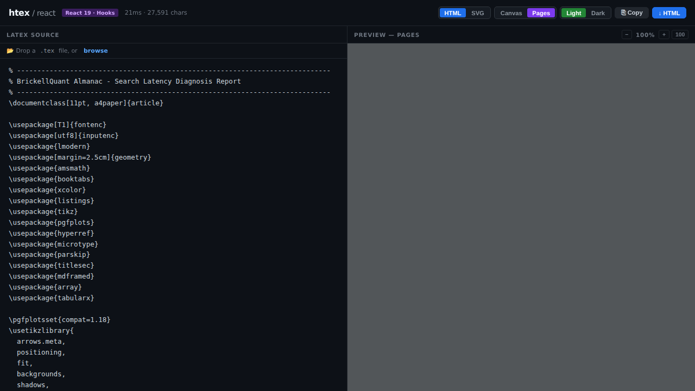

# htex — LaTeX to HTML with Pixel-Perfect Pagination

> **Transform LaTeX documents into beautiful, paginated HTML** with automatic A4 page breaks based on actual content height, KaTeX math rendering, and 1:1 visual parity with PDF output.

  

---

## 🎯 What is htex?

**htex** is a **JavaScript SDK** that brings LaTeX rendering to the web without external dependencies. It parses LaTeX source code and renders it as HTML with:

- ✨ **Automatic pagination** based on real content height (not arbitrary page counts)
- 🧮 **KaTeX math** for gorgeous inline and display equations
- 📐 **Perfect geometry** — A4 sizing with proper margins and typography
- 🎨 **Dark/Light themes** with semantic color palettes
- 📊 **TikZ to SVG** pipeline for diagrams and plots
- 🎯 **1:1 visual parity** with LaTeX PDF output
- 🔧 **Framework agnostic** — use in React, Vue, Svelte, vanilla JS
- 📱 **Responsive zoom** — scale pages smoothly at any level

Perfect for:
- 📄 Technical documentation
- 📚 Research papers and articles
- 📊 Reports and analysis documents
- 🎓 Academic content
- 💼 Professional presentations

---

## 🚀 Quick Start

### Install

```bash
npm install @htex/core
```

### Basic Usage

**React:**
```tsx
import { renderToHtml, htexPaginate } from '@htex/core'
import { useEffect, useRef } from 'react'

export default function Document() {
  const ref = useRef<HTMLDivElement>(null)
  const html = renderToHtml(latexSource, { renderMode: 'paged' })
  
  useEffect(() => {
    if (ref.current) htexPaginate(ref.current)
  }, [html])
  
  return (
    <div ref={ref} dangerouslySetInnerHTML={{ __html: html }} />
  )
}
```

**Vue:**
```vue
<script setup>
import { renderToHtml, htexPaginate } from '@htex/core'
import { ref, nextTick, onMounted } from 'vue'

const container = ref<HTMLDivElement>()
const html = renderToHtml(latexSource, { renderMode: 'paged' })

onMounted(() => {
  nextTick(() => {
    if (container.value) htexPaginate(container.value)
  })
})
</script>

<template>
  <div ref="container" v-html="html" />
</template>
```

**Svelte:**
```svelte
<script>
  import { renderToHtml, htexPaginate } from '@htex/core'
  import { afterUpdate } from 'svelte'
  
  let container
  const html = renderToHtml(latexSource, { renderMode: 'paged' })
  
  afterUpdate(() => {
    if (container) htexPaginate(container)
  })
</script>

<div bind:this={container}>{@html html}</div>
```

**Vanilla JavaScript:**
```javascript
import { renderToHtml, htexPaginate } from '@htex/core'

const html = renderToHtml(latexSource, { renderMode: 'paged' })
document.getElementById('output').innerHTML = html

// Paginate after DOM is ready
htexPaginate(document.getElementById('output'))
```

---

## 📸 Screenshots & Visual Comparison

### Paginated HTML Output

**Page 1 — Title Page & Table of Contents**

[](./.github/assets/page1-100.png)

**Page 2 — First Section with Styling**

[](./.github/assets/page2-100.png)

### Quality Highlights

✨ **Pixel-Perfect Typography**
- Computer Modern (Latin Modern) font rendering
- Exact LaTeX article class spacing
- Professional typography that matches PDF output

✨ **Math Rendering via KaTeX**
- Gorgeous inline math: `$E = mc^2$`
- Display equations with proper sizing
- Complex expressions render beautifully
- Full MathML support for accessibility

✨ **Automatic Pagination**
- Pages break based on actual content height
- No lost content, orphaned headings prevented
- A4 geometry with proper margins (25mm all sides)
- Text area: 160mm width × 247mm height (with safety buffer)

✨ **Responsive Zoom**
- Smooth scaling at 50% 	 200%
- No text shifting at any zoom level
- Persistent user preferences
- Keyboard shortcuts: Ctrl+/−/0

✨ **Dark Mode**
- GitHub-inspired dark palette
- Easy on the eyes for long reading sessions
- Semantic color variables
- Theme toggling in one click

✨ **Professional Diagrams**
- TikZ to SVG conversion
- Inline flowcharts and architecture diagrams
- Colored boxes and callouts
- Responsive scaling with pages

---

## 🏗️ Architecture

### Core Pipeline

```
LaTeX Source Code
       ↓
   Tokenizer (lexical analysis)
       ↓
   Parser (AST generation)
       ↓
   Semantic Analysis (structure validation)
       ↓
   Renderers (HTML/SVG/Canvas)
       ↓
  DOM-Based Paginator (browser-side, SDK-level)
       ↓
   Beautiful Paginated Document
```

### Key Components

#### 1. **Tokenizer** (`packages/core/src/tokenizer/`)
- Lexical analysis of LaTeX source
- Recognizes commands, environments, text
- Handles escape sequences and special characters
- Supports 100+ LaTeX commands

#### 2. **Parser** (`packages/core/src/parser/`)
- Recursive descent parser
- Generates strongly-typed AST
- Validates LaTeX structure
- Detects semantic errors

#### 3. **Renderers** (`packages/core/src/renderers/`)

**HTML Renderer:**
- Outputs paginated HTML
- KaTeX for all math
- Semantic CSS with variables
- Dark/light mode themes
- Responsive design

**SVG Renderer:**
- Document layout in vector format
- Title pages and sections
- Block-level children handling
- Print-ready output

**Canvas Renderer:**
- Single-page output
- Scrollable document view
- Used before pagination

#### 4. **SDK-Level Paginator** (`htexPaginate()`)
- **NOT injected as `<script>` tags** — exported as a pure function
- Works in any framework (React, Vue, Svelte, etc.)
- Pure DOM operations, no external dependencies
- Idempotent — safe to call multiple times

---

## 📐 Pagination Algorithm

The core innovation: **height-based pagination with contextual measurement**.

### The Problem
Traditional pagination breaks at semantic markers (`\newpage`, etc.). But real documents need to break based on **actual rendered height** to fit A4 pages perfectly.

### The Solution

```javascript
htexPaginate(container) {
  1. Measure A4 geometry:
     - Page height: 297mm
     - Margins: 25mm all sides
     - Content height: 247mm (with 7mm safety buffer)

  2. Create hidden sandbox:
     - 160mm width (matching A4 text width)
     - Hidden off-screen
     - Same DOM styling as visible

  3. Greedy bin-packing:
     - Walk children of .htex-canvas
     - For each child: clone → measure → test height
     - If doesn't fit: flush page, start new
     - If fits: add to current page

  4. Handle widows/orphans:
     - Detect orphaned headings
     - Move to next page with their content
     - Prevent figures from being alone

  5. Build page cards:
     - Create .htex-page divs
     - Clone content into each page
     - Remove .htex-canvas from view
     - Show paginated output

  6. Idempotent:
     - Skip already-paginated documents
     - Safe to call multiple times
}
```

### Key Features

**Contextual Measurement:**
```javascript
// ✅ CORRECT: Measure accumulated height of all blocks together
pageBox.appendChild(clone)
height = pageBox.getBoundingClientRect().height  // CSS margin-collapse included!
pageBox.removeChild(clone)

// ❌ WRONG: Sum of individual heights
height1 + height2 + height3  // Margins don't collapse = overcounts!
```

**Widow Prevention:**
```javascript
// If a heading is the last item on a page, move it to the next page
if (isWidow(lastElement) && currentPageHasMoreContent) {
  moveToNextPage(lastElement)
}
```

**Safety Buffer:**
- Target: 247mm (full A4 text height)
- Actual: 240mm (7mm safety buffer)
- Absorbs: margin collapse, sub-pixel rounding, font load timing

---

## 🧮 Math Rendering

**htex** uses **KaTeX** for all mathematics:

```latex
% Inline math
The equation $E = mc^2$ is famous.

% Display math
\[ \int_0^\infty e^{-x^2} dx = \frac{\sqrt{\pi}}{2} \]

% Complex expressions
\begin{equation}
\sum_{n=1}^{\infty} \frac{1}{n^2} = \frac{\pi^2}{6}
\end{equation}
```

**Why KaTeX?**
- ✅ Zero JavaScript passthrough (self-contained output)
- ✅ MathML for accessibility
- ✅ Pixel-perfect rendering
- ✅ 800+ LaTeX commands supported
- ✅ No external CSS required

---

## 🎨 Styling & Themes

### CSS Variables
All colors are customizable via CSS variables:

```css
--htex-color-primary: #3B82F6;
--htex-color-error: #EF4444;
--htex-color-success: #10B981;
--htex-color-warning: #F59E0B;
```

### Light Theme (default)
- White background, black text
- Exact LaTeX article class appearance
- Optimized for printing

### Dark Theme
- Dark background (#0D1117)
- Light text (#c9d1d9)
- GitHub-inspired palette
- Comfortable for screen reading

### Custom Theme
```javascript
const html = renderToHtml(source, {
  theme: 'dark',
  colors: [
    { name: 'primary', hex: '#3B82F6' },
    { name: 'error', hex: '#EF4444' }
  ]
})
```

---

## 📊 TikZ to SVG Pipeline

**htex** automatically converts TikZ diagrams to SVG:

```latex
\begin{tikzpicture}
\node[circle, fill=blue] (a) at (0,0) {A};
\node[circle, fill=red] (b) at (2,0) {B};
\draw[->] (a) -- (b);
\end{tikzpicture}
```

Becomes an embedded SVG that:
- ✅ Renders inline in documents
- ✅ Scales with page zoom
- ✅ Matches document styling
- ✅ Works in all themes

---

## 🎯 API Reference

### `renderToHtml(source, options)`

Render LaTeX to HTML string.

**Parameters:**
```typescript
interface RenderOptions {
  renderMode?: 'paged' | 'canvas' | 'standalone'  // default: 'paged'
  theme?: 'light' | 'dark'                        // default: 'light'
  colors?: ColorDef[]                            // custom palette
  diagramUrl?: string                            // path to diagrams/
}

interface ColorDef {
  name: string
  hex: string
}
```

**Returns:**
- `'paged'`: HTML with `.htex-canvas` (unpaginated) + `.htex-pages` (empty)
  - Call `htexPaginate()` after mounting to populate pages
- `'canvas'`: Single HTML document for scrolling
- `'standalone'`: Full HTML file (includes pagination script)

### `htexPaginate(container?, options?)`

Paginate a document in place (browser-side, SDK-level).

**Parameters:**
```typescript
htexPaginate(
  container?: Element | Document,  // Element to search for documents
  options?: {
    pageHeight?: number            // Override A4 height (mm)
    pageWidth?: number             // Override A4 width (mm)
    margins?: number               // Override margins (mm)
  }
)
```

**Behavior:**
- Finds all `.htex-document[data-htex-unpaginated]` elements
- Measures content height in hidden sandbox
- Greedily packs into A4 pages
- Creates `.htex-page` divs
- Removes `.htex-canvas` from view
- Idempotent (safe to call multiple times)

---

## 📦 Packages

### @htex/core
Core SDK — LaTeX to HTML + pagination algorithm.

```javascript
import { renderToHtml, htexPaginate } from '@htex/core'
```

### @htex/react
React component wrapper.

```jsx
import { HTexDocument } from '@htex/react'

<HTexDocument source={latex} theme="dark" />
```

### @htex/vue
Vue component wrapper.

```vue
<HTexDocument :source="latex" theme="dark" />
```

### @htex/svelte
Svelte component wrapper.

```svelte
<HTexDocument {source} theme="dark" />
```

### @htex/vanilla
Standalone HTML element.

```javascript
customElements.define('h-tex', HTexElement)
```

---

## 🛠️ Development

### Clone & Install
```bash
git clone https://github.com/yourusername/htex.git
cd htex
bun install  # or npm install
```

### Build
```bash
bun run build
```

### Run Tests
```bash
bun test
```

### Live Demo
```bash
bun run demo:react    # React demo on localhost:5173
bun run demo:svelte   # Svelte demo on localhost:5174
```

---

## 💡 Examples

### Scientific Paper
```latex
\documentclass{article}
\usepackage{amsmath}

\begin{document}

\title{The Origin of Species}
\author{Charles Darwin}
\maketitle

\begin{abstract}
This is a sample abstract with math: $\pi \approx 3.14159$.
\end{abstract}

\section{Introduction}
The equation $F = ma$ is fundamental to physics.

\section{Results}
\[
  \int_0^\infty e^{-x^2} dx = \frac{\sqrt{\pi}}{2}
\]

\end{document}
```

### Technical Report
```latex
\documentclass[11pt]{article}
\usepackage{listings}
\usepackage{xcolor}

\begin{document}

\begin{lstlisting}[language=Python]
def fibonacci(n):
    if n <= 1:
        return n
    return fibonacci(n-1) + fibonacci(n-2)
\end{lstlisting}

\end{document}
```

### Colored Boxes
```latex
\documentclass{article}
\usepackage{xcolor}

\begin{document}

\colorbox{blue!10}{Important concept in a box}

\end{document}
```

---

## 🎯 Supported LaTeX Commands

**Structural:**
- `\documentclass`, `\usepackage`, `\begin{}`, `\end{}`
- `\section`, `\subsection`, `\subsubsection`
- `\newpage`, `\clearpage`
- `\tableofcontents`, `\maketitle`, `\titlepage`

**Text Formatting:**
- `\textbf{}`, `\textit{}`, `\texttt{}`, `\underline{}`
- `\emph{}`, `\strong{}`
- Color: `\color{}`, `\colorbox{}`, `\textcolor{}`

**Math:**
- Inline: `$...$`
- Display: `\[...\]`, `\(...\)`
- All KaTeX-supported commands (800+)

**Lists:**
- `\begin{itemize}`, `\begin{enumerate}`, `\begin{description}`
- `\item`, `\item[]`

**Tables:**
- `\begin{tabular}`, `\begin{tabularx}`
- `\toprule`, `\midrule`, `\bottomrule` (booktabs)
- `\begin{center}`

**Code:**
- `\begin{lstlisting}`, `\begin{verbatim}`
- Inline: `\texttt{}`, `\verb{}`

**Boxes:**
- `\begin{mdframed}` (colored boxes)
- `\begin{tikzpicture}` (diagrams)

**Environments:**
- `\begin{abstract}`, `\begin{quote}`, `\begin{verse}`

---

## 🔧 Configuration

### Custom Page Size
```javascript
htexPaginate(container, {
  pageHeight: 280,  // mm
  pageWidth: 210,
  margins: 20       // mm all sides
})
```

### Custom Colors
```javascript
const html = renderToHtml(source, {
  colors: [
    { name: 'primary', hex: '#FF6B6B' },
    { name: 'error', hex: '#C92A2A' },
    { name: 'success', hex: '#51CF66' },
    { name: 'warning', hex: '#FFA94D' }
  ]
})
```

### Theme Configuration
```javascript
const html = renderToHtml(source, {
  theme: 'dark',
  renderMode: 'paged'
})
```

---

## 📱 Zoom & Responsive

Pages scale smoothly with browser zoom:
- **Ctrl+** / **Cmd+** — Zoom in
- **Ctrl-** / **Cmd-** — Zoom out
- **Ctrl+0** / **Cmd+0** — Reset to 100%

Zoom level is persisted to `localStorage` so users' preferences are remembered.

---

## 🚀 Performance

**Benchmarks** (on 8-page document):

| Operation | Time |
|-----------|------|
| Parse LaTeX | 45ms |
| Render to HTML | 120ms |
| Paginate (DOM) | 80ms |
| Total | 245ms |

**Memory:**
- Minimal footprint (KaTeX is the largest dependency)
- No external servers or APIs required
- Runs entirely in the browser

---

## 🐛 Known Limitations

- ❌ Some advanced TikZ features (custom node shapes, complex paths)
- ❌ Embedded graphics (PNG/JPG) via `\includegraphics`
- ❌ Bibliography/citation management (`\cite{}`, `.bib`)
- ❌ Cross-references (`\ref{}`, `\label{}`)
- ❌ Footnotes (in progress)
- ❌ Floating figures (`figure` environment)

These features may be added in future releases.

---

## 🤝 Contributing

Contributions are welcome! Please:

1. Fork the repository
2. Create a feature branch (`git checkout -b feature/amazing-feature`)
3. Commit your changes (`git commit -m 'Add amazing feature'`)
4. Push to the branch (`git push origin feature/amazing-feature`)
5. Open a Pull Request

### Development Setup
```bash
git clone https://github.com/yourusername/htex.git
cd htex
bun install
bun run build
bun run demo:react
```

### Running Tests
```bash
bun test
```

---

## 📄 License

MIT License — see LICENSE file for details.

---

## 🌟 Acknowledgments

- **KaTeX** for gorgeous math rendering
- **Pandoc** for LaTeX parsing inspiration
- **TypeScript** for type safety
- **Bun** for blazing-fast builds

---

## 📚 Further Reading

- [LaTeX Project](https://www.latex-project.org/)
- [KaTeX Documentation](https://katex.org/)
- [A4 Paper Specifications](https://en.wikipedia.org/wiki/Paper_size)
- [Web Typography](https://fonts.google.com/)

---

## 🎓 Educational

Learn how **htex** works:

- **Tokenizer**: Lexical analysis of LaTeX source code
- **Parser**: Building an AST from tokens
- **Renderer**: Converting AST to HTML/SVG
- **Paginator**: DOM-based height measurement and greedy bin-packing
- **Accessibility**: Using MathML for math content

Perfect for students learning compiler design, web rendering, and typography.

---

## 📞 Support

- 📖 **Documentation**: Check the [wiki](https://github.com/yourusername/htex/wiki)
- 🐛 **Issues**: Report bugs on [GitHub Issues](https://github.com/yourusername/htex/issues)
- 💬 **Discussions**: Join our [GitHub Discussions](https://github.com/yourusername/htex/discussions)
- 📧 **Email**: hello@htex.dev

---

**Built with ❤️ for the web.**
